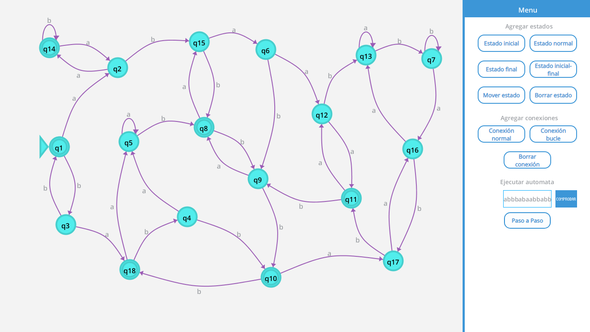

Programa desarrollado como proyecto final para la asignatura de Programación orientada a objetos, el programa le permite
al usuario crear un autómata finito de manera gráfica y permite ejecutar el autómata paso a paso para verificar si una cadena de texto
es aceptada o rechazada por el autómata.
